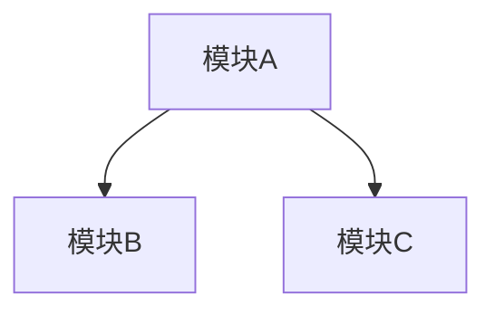
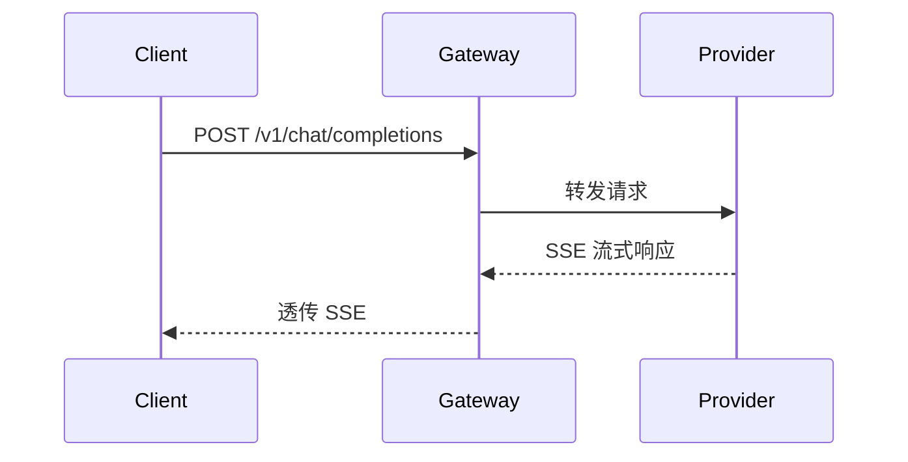
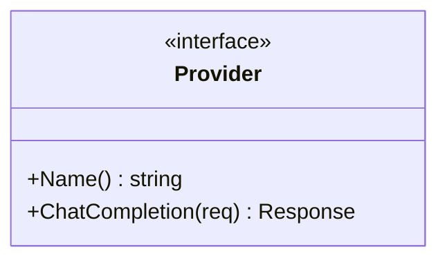

# /auto-dev-design — 设计方案生成

从需求描述生成设计方案文档，经人审批后冻结，作为后续 test-spec 生成和代码实现的依据。

融合 Superpowers（多方案探索）、Spec Kit（架构原则约束）、DDD（模式识别）和 Wizard（对抗性自审）的最佳实践。

---

## 执行逻辑

### 1. 前置检查

- 加载 `.auto-dev.yaml`，获取项目语言、框架、模块结构等信息
  - 如果不存在 → 先执行 `/auto-dev-init`
- 检查 `designs/` 目录下是否已有相关设计文档
  - 如果存在已审批的设计文档 → 提示用户：「检测到已有设计文档 <文件名>，是否基于它修改？回复"修改"更新现有设计，或"重新设计"从头开始。」
- 检查项目根目录和各模块的 `CLAUDE.md`，提取其中的架构约定和规范
  - 将这些约定作为**架构原则**，设计方案不得违背

### 2. 理解需求

1. 读取用户描述的需求（直接输入或指向文档路径）
2. **先理解再动手**：阅读项目中与需求相关的现有代码，理解当前架构、接口风格、命名约定
3. 分析影响范围：
   - **需要修改的文件**：列出具体文件路径和修改原因
   - **需要新增的文件**：列出文件路径和职责说明
   - **可能受影响的已有功能**：列出需要做回归测试的模块
4. 识别涉及的**架构模式**（如适用）：分层架构、适配器模式、策略模式、工厂模式、熔断器模式、发布-订阅等
5. 向用户输出需求理解和影响分析，**请用户确认理解是否正确**

### 3. 多方案探索

> 灵感来源：Superpowers brainstorming — 强制探索多条路径，避免锚定在第一直觉上。

**对于 L/XL 复杂度的任务，必须提出 2-3 种设计方案**，每种方案包含：

```
### 方案 A: <方案名称>

**核心思路**: <一句话描述>

**优势**:
- ...

**劣势**:
- ...

**适用场景**: <什么情况下选这个>

**复杂度评估**: 预计改动 X 个文件，新增 Y 个文件
```

每个方案的分析维度：

| 维度 | 说明 |
|------|------|
| 实现复杂度 | 代码量、改动文件数、新增概念数 |
| 扩展性 | 未来需求变更时的适应能力 |
| 性能影响 | 对吞吐、延迟、内存的影响 |
| 可测试性 | 单元测试和集成测试的难易度 |
| 侵入性 | 对已有代码的改动程度 |
| 风险 | 引入 bug 或回归问题的概率 |

**给出推荐方案并说明理由**，但最终由用户决定。

**对于 S/M 复杂度的任务**，可以只提出 1 种方案，但仍需简要说明"为什么不用另一种做法"。

用户选定方案后，进入详细设计阶段。

### 4. 生成设计文档

在 `designs/` 目录下生成 `<feature-name>.md`，包含以下章节：

#### 4.1 概述

- 功能目标（一句话概括）
- 背景和动机
- 复杂度评估：S / M / L / XL

#### 4.2 架构决策记录（ADR）

> 记录选择了什么、放弃了什么、为什么。避免后续接手者重新争论已决定的事项。

```
### 决策: <决策标题>

**背景**: <面临的技术问题>

**考虑的方案**:
1. <方案 A> — <一句话>
2. <方案 B> — <一句话>
3. <方案 C（如有）> — <一句话>

**决定**: 采用方案 X

**理由**: <为什么选它，核心 tradeoff 是什么>

**后果**: <这个决定带来的约束或后续影响>
```

如果第 3 步中有多方案探索，直接将用户的选择和理由记录为 ADR。单个设计可能包含多个 ADR（如技术选型、接口风格、存储方案等分别记录）。

#### 4.3 架构视图

使用 Mermaid 图表描述系统结构（选择最能表达设计意图的类型）：

**组件/模块图**（展示模块间关系）:


**时序图**（展示关键流程的调用链路）:


**类图/接口图**（展示核心类型关系，仅在涉及复杂类型设计时使用）:


选择原则：
- S/M 任务：可省略，或只画一个简要流程图
- L 任务：至少一个组件图 + 一个时序图
- XL 任务：组件图 + 时序图 + 类图/接口图

#### 4.4 接口设计

- 新增/修改的 API 接口（路由、方法、请求参数、响应格式）
- 新增/修改的内部函数/方法签名
- 新增/修改的 CLI 命令（如果适用）

#### 4.5 数据结构

- 新增/修改的类型、结构体、模型
- 数据库 schema 变更（如果适用）
- 配置项变更

#### 4.6 核心流程

- 主要业务逻辑的流程描述（文字或伪代码）
- 关键决策点和分支逻辑
- 异步/并发处理（如果适用）
- 调用链路和模块间依赖

#### 4.7 错误处理

- 可能的错误场景和处理策略
- 错误码定义（如果适用）
- 降级和容错方案

#### 4.8 文件变更清单

逐个文件标明：改什么、为什么改。

```
| 文件 | 操作 | 说明 |
|------|------|------|
| `path/to/file` | 新增/修改 | <改动内容和原因> |
```

#### 4.9 非功能性考量（可选）

- 性能影响评估
- 安全性考量
- 向后兼容性

### 5. 对抗性自审

> 灵感来源：Wizard 的 adversarial review — 在呈现给用户之前，自己先做"红队"审查。

在将设计文档呈现给用户之前，对方案进行自我审查，检查以下维度：

#### 5.1 正确性审查

- [ ] 设计是否完整覆盖了用户需求？有无遗漏的场景？
- [ ] 接口签名是否完整（入参、出参、错误类型都已定义）？
- [ ] 是否有未定义的行为（输入为空、超时、并发访问时会怎样）？

#### 5.2 架构原则合规

- [ ] 是否符合项目 CLAUDE.md 中定义的架构约定？
- [ ] 是否遵循项目已有的分层模式（handler → service → repository）？
- [ ] 是否引入了不必要的新依赖或新模式？
- [ ] 模块间耦合是否合理？有无循环依赖？

#### 5.3 风险审查

- [ ] 有无竞态条件（并发读写共享状态）？
- [ ] 有无资源泄漏风险（连接、文件句柄、goroutine）？
- [ ] 有无安全隐患（注入、越权、敏感信息泄露）？
- [ ] 有无性能瓶颈（N+1 查询、无限缓存增长、阻塞调用）？

#### 5.4 可测试性审查

- [ ] 关键逻辑是否可以通过接口/依赖注入来隔离测试？
- [ ] 外部依赖（数据库、HTTP、文件系统）是否可以 mock？
- [ ] 边界条件是否明确到可以直接编写测试用例？

如果自审发现问题，**直接在设计文档中修正**，并在文档末尾附上自审结论：

```
## 自审结论

| 维度 | 状态 | 备注 |
|------|------|------|
| 正确性 | ✓ 通过 | |
| 架构合规 | ✓ 通过 | |
| 风险 | ⚠ 注意 | <具体风险和缓解措施> |
| 可测试性 | ✓ 通过 | |
```

### 6. 请用户审查

输出设计文档摘要（概述 + ADR + 架构图 + 文件变更清单 + 自审结论），明确询问：

「请审查以上设计方案。确认无误后请回复"approved"，我将冻结设计文档并进入测试规格生成阶段。如需修改请直接说明。」

**必须等待用户明确审批后才能继续。**

### 7. 审批后冻结

1. 将 `designs/<feature-name>.md` 加入 `.auto-dev.yaml` 的 `frozen_files` 列表
2. 计算 SHA-256 校验和，写入 `frozen_checksums`
3. 后续 AI 不可修改该设计文档（如需修改，必须退回重新审批）
4. 提示用户：「设计方案已冻结。下一步请执行 `/auto-dev-spec` 生成测试规格。」

---

## 重要原则

- **先理解再动手**：生成设计前必须先阅读相关现有代码，理解当前架构，不可凭空设计。
- **多方案必选**：L/XL 任务必须提出 2-3 种方案并分析 tradeoff，不可只给一种方案。S/M 任务至少说明"为什么不用其他做法"。
- **决策留痕**：每个重要的技术选择都要以 ADR 形式记录，包括被放弃的方案和原因。
- **架构图优先**：能用图表达的不用文字。组件关系、调用链路、类型继承关系都应有 Mermaid 图。
- **自审先于人审**：在呈现给用户前先做对抗性自审，不要把明显的缺陷留给用户发现。
- **设计服务于验证**：设计文档的粒度应足以支撑 test-spec 生成。接口签名、输入输出、错误场景都要明确，不留模糊空间。
- **最小变更**：设计应优先通过扩展而非修改来实现，减少对已有代码的侵入。
- **用户是审批者**：设计方案必须经人审批后才能冻结，AI 不可自行跳过审批。
- **冻结不可违**：设计文档一旦冻结，实现阶段不可偏离。如需调整，必须退回重新审批。
- **错误脱敏**：面向用户的错误信息不得暴露内部路径、堆栈或敏感配置。
